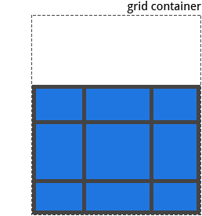
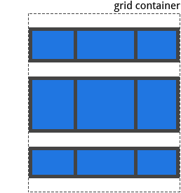
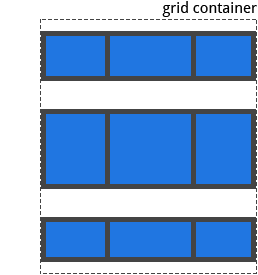
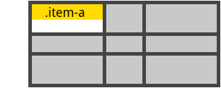
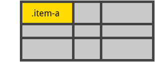
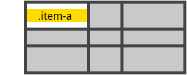

#grid-kiss: Keep CSS Grids simple, stupid

This is a [PostCSS][postcss-website] plugin aiming to replace the 24 new properties brought by [CSS Grids][w3c-spec] with a single one that you immediately understand when you see it.

##Example

```
body {
	grid-kiss:
		"+-------------------------------+      "
		"|           header ↑            | 120px"
		"+-------------------------------+      "
		"                                       "
		"+-- 30% ---+  +--- auto --------+      "
		"| .sidebar |  |       main      | auto "
		"+----------+  +-----------------+      "
		"                                       "
		"+-------------------------------+      "
		"|              ↓                | 60px "
		"|         → footer ←            |      "
		"+-------------------------------+      "
}
```

is converted to:

```
body > header {
	grid-area: header;
	align-self: start
}

body > .sidebar {
	grid-area: sidebar
}

body > main {
	grid-area: main
}

body > footer {
	grid-area: footer;
	justify-self: center;
	align-self: end
}

body {
	display: grid;
	align-content: space-between;
	grid-template-rows: 120px 1fr 60px;
	grid-template-columns: 30% 1fr;
	grid-template-areas: 
	"header  header"
	"sidebar main  "
	"footer  footer"
}
```

## [Try it online][playground]

You can play with the plugin on the [playground][playground]. Edit the CSS and HTML on the left and the grid will be updated instantly.

## How to draw a grid

- Draw the different zones of your grid as shown in the example
- Inside every zone, write a CSS selector that matches the corresponding element. It can be a `tag` name, a `.class`, an `#id`, or `any.other[valid]#selector`
- The elements matched have to be **direct descendants** of the grid element
- Separate each row by a newline (`\n`) and give the same indentation level to every row
- Make sure each row starts and end by a double quote `"`
- Make sure the zone corners (`+`) are correctly aligned. Every index in the rows where a corner character is found creates a new column.
- Do not hesitate to make large zones with unused space, it may be useful for future modifications
- Use Insert. key and Multi-cursor if supported by your editor to draw and edit your grids easily

## Alternative styles

- `┌ ┐ └ ┘` for corners and `│ ─` for segments

```
div {
	grid-kiss:		   
	"┌──────┐  ┌──────┐         "
	"│      │  │  ↑   │         "
	"│      │  │ bar →│  200px  "
	"│  ↓   │  └──────┘         "
	"│ baz  │              -    "
	"│  ↑   │  ┌──────┐         "
	"│      │  │  ↑   │  200px  "
	"└──────┘  │      │         "
	"          │ foo  │    -    "
	"┌──────┐  │      │         "
	"│ qux  │  │  ↓   │  200px  "
	"│  ↓   │  │      │         "
	"└─20em─┘  └──────┘         "
}
```

- `╔ ╗ ╚ ╝` for corners and `║ ═` for segments

```
main {
	grid-kiss:		   
	"╔═══════╗  ╔════════════════╗      "
	"║       ║  ║    .article    ║ auto "
	"║   ↑   ║  ╚════════════════╝      "
	"║  nav  ║  ╔════╗  ╔════════╗      "
	"║       ║  ║    ║  ║ aside →║ 240px"
	"╚═ 25% ═╝  ╚════╝  ╚═ 80em ═╝      "
}
```


## Properties supported

### on the grid

- `display: grid` ✅
- `grid-template-columns` ✅
- `grid-template-rows` ✅
- `grid-template-areas` ✅
- `grid-column-gap` [❌][1]
- `grid-row-gap` [❌][1]
- `grid-gap` [❌][1]
**
- `justify-items` [❌][2] 
- `align-items` [❌][2]
- `justify-content` ✅
- `align-content` ✅
- `grid-auto-columns` [❌][3]
- `grid-auto-rows` [❌][3]
- `grid-auto-flow` [❌][3]
- `grid` [❌][4]

[1]: gaps are actually faked as empty zones, so you can draw these zones explicitely

[2]: `justify-items` and `align-items` are not used on the container level, instead use alignment helpers for each zone

[3]: `grid-auto-columns`, `grid-auto-rows` and `grid-auto-flow` are not used, instead define explicitely all the zones

[4]: `grid-kiss` aims to replace the `grid` property

### on the zones (a.k.a. grid items)

- `grid-column-start` [❌][5]
- `grid-column-end` [❌][5]
- `grid-row-start` [❌][5]
- `grid-row-end` [❌][5]
- `grid-column` [❌][5]
- `grid-row` [❌][5]
- `grid-area` ✅
- `justify-self` ✅
- `align-self` ✅

[5] named areas are used instead of indexes

## Alignment of the grid

Specifies how all the zones are aligned inside the grid container. Irrelevant if one of the zones fits all the remaining free space.

### Horizontal alignment of the grid

- `justify-content: stretch`
when there are no two consecutive spaces at the beginning or the end of the rows
```
"+---+ +---+ +---+"
"| a | | b | | c |"
"+---+ +---+ +---+"
"+---+ +---+ +---+"
"| d | | e | | f |"
"+---+ +---+ +---+"
"+---+ +---+ +---+"
"| g | | h | | i |"
"+---+ +---+ +---+"
``` 


- `justify-content: start`
when there are two consecutive spaces or more at the end of the rows
```
"+---+ +---+ +---+    "
"| a | | b | | c |    "
"+---+ +---+ +---+    "
"+---+ +---+ +---+    "
"| d | | e | | f |    "
"+---+ +---+ +---+    "
"+---+ +---+ +---+    "
"| g | | h | | i |    "
"+---+ +---+ +---+    "
``` 


- `justify-content: end`

when there are two consecutive spaces or more at the beginning of the rows
```
"    +---+ +---+ +---+"
"    | a | | b | | c |"
"    +---+ +---+ +---+"
"    +---+ +---+ +---+"
"    | d | | e | | f |"
"    +---+ +---+ +---+"
"    +---+ +---+ +---+"
"    | g | | h | | i |"
"    +---+ +---+ +---+"
``` 


- `justify-content: center`
when there are two consecutive spaces or more at the beginning and the end of the rows
```
"    +---+ +---+ +---+    "
"    | a | | b | | c |    "
"    +---+ +---+ +---+    "
"    +---+ +---+ +---+    "
"    | d | | e | | f |    "
"    +---+ +---+ +---+    "
"    +---+ +---+ +---+    "
"    | g | | h | | i |    "
"    +---+ +---+ +---+    "
```


- `justify-content: space-between`
when there are two consecutive spaces or more between zones
```
"+---+    +---+    +---+"
"| a |    | b |    | c |"
"+---+    +---+    +---+"
"+---+    +---+    +---+"
"| d |    | e |    | f |"
"+---+    +---+    +---+"
"+---+    +---+    +---+"
"| g |    | h |    | i |"
"+---+    +---+    +---+"
```


- `justify-content: space-evenly`
when there are two consecutive spaces or more at the beginning and the end of the rows, and exactly two consecutive spaces between zones
```
"    +---+  +---+  +---+    "
"    | a |  | b |  | c |    "
"    +---+  +---+  +---+    "
"    +---+  +---+  +---+    "
"    | d |  | e |  | f |    "
"    +---+  +---+  +---+    "
"    +---+  +---+  +---+    "
"    | g |  | h |  | i |    "
"    +---+  +---+  +---+    "
```


- `justify-content: space-around`
when there are two consecutive spaces or more at the beginning and the end of the rows, and four consecutive spaces or more between zones
```
"  +---+    +---+    +---+  "
"  | a |    | b |    | c |  "
"  +---+    +---+    +---+  "
"  +---+    +---+    +---+  "
"  | d |    | e |    | f |  "
"  +---+    +---+    +---+  "
"  +---+    +---+    +---+  "
"  | g |    | h |    | i |  "
"  +---+    +---+    +---+  "
```


### Vertical alignment of the grid

- `align content: stretch`
when no space rows
```
"+---+ +---+ +---+"
"| a | | b | | c |"
"+---+ +---+ +---+"
"+---+ +---+ +---+"
"| d | | e | | f |"
"+---+ +---+ +---+"
"+---+ +---+ +---+"
"| g | | h | | i |"
"+---+ +---+ +---+"
``` 


-  `align-content: start`
when at least one space row at the end
```
"+---+ +---+ +---+"
"| a | | b | | c |"
"+---+ +---+ +---+"
"+---+ +---+ +---+"
"| d | | e | | f |"
"+---+ +---+ +---+"
"+---+ +---+ +---+"
"| g | | h | | i |"
"+---+ +---+ +---+"
"                 "
"                 "
``` 


- `align-content: end`
when at least one space row at the beginning
```
"                 "
"                 "
"+---+ +---+ +---+"
"| a | | b | | c |"
"+---+ +---+ +---+"
"+---+ +---+ +---+"
"| d | | e | | f |"
"+---+ +---+ +---+"
"+---+ +---+ +---+"
"| g | | h | | i |"
"+---+ +---+ +---+"
``` 



- `align-content: center`
when at least one space row at the beginning and one space row at the end

```
"                 "
"+---+ +---+ +---+"
"| a | | b | | c |"
"+---+ +---+ +---+"
"+---+ +---+ +---+"
"| d | | e | | f |"
"+---+ +---+ +---+"
"+---+ +---+ +---+"
"| g | | h | | i |"
"+---+ +---+ +---+"
"                 "
```


- `align-content: space-between`
when there is one space row between zones

```
"+---+ +---+ +---+"
"| a | | b | | c |"
"+---+ +---+ +---+"
"                 "
"+---+ +---+ +---+"
"| d | | e | | f |"
"+---+ +---+ +---+"
"                 "
"+---+ +---+ +---+"
"| g | | h | | i |"
"+---+ +---+ +---+"
```


- `align-content: space-evenly`
when there is one space row at the beginning, at the end and between zones

```
"                 "
"+---+ +---+ +---+"
"| a | | b | | c |"
"+---+ +---+ +---+"
"                 "
"+---+ +---+ +---+"
"| d | | e | | f |"
"+---+ +---+ +---+"
"                 "
"+---+ +---+ +---+"
"| g | | h | | i |"
"+---+ +---+ +---+"
"                 "
```



- `align-content: space-around`
when there is one space row at the beginning and at the end, and two space rows between zones

```
"                 "
"+---+ +---+ +---+"
"| a | | b | | c |"
"+---+ +---+ +---+"
"                 "
"                 "
"+---+ +---+ +---+"
"| d | | e | | f |"
"+---+ +---+ +---+"
"                 "
"                 "
"+---+ +---+ +---+"
"| g | | h | | i |"
"+---+ +---+ +---+"
"                 "
```



## Alignment inside zones

Each zone can specify an alignment indicator. When no indicators are specified, defaults are stretch horizontally and vertically.

### Horizontal alignment inside a zone

- `justify-self: start` with `<` or `←`
```
+-------------+    +-------------+  
| <  .item-a  | or | ←  .item-a  |
+-------------+    +-------------+
``` 


- `justify-self: end` with `>` or `→`
```
+-------------+    +-------------+
| .item-a   > | or | .item-a   → |
+-------------+    +-------------+
``` 


- `justify-self: stretch` with `<` and `>` or `←` and `→` in this order
```
+--------------+    +--------------+
| < .item-a  > | or | ← .item-a  → |
+--------------+    +--------------+
``` 


- `justify-self: center` with `>` and `<` or `→` and `←` in this order
```
+--------------+    +--------------+
| > .item-a  < | or | → .item-a  ← |
+--------------+    +--------------+
``` 


### Vertical alignment inside a zone

- `align-self: start` with `^` or `↑`
```
+-------------+    +-------------+
|      ^      | or |      ↑      |
|   .item-a   |    |   .item-a   |
+-------------+    +-------------+
``` 


- `align-self: end` with ` v ` or `↓`
```
+-------------+    +-------------+
|   .item-a   | or |   .item-a   |
|      v      |    |      ↓      |
+-------------+    +-------------+
``` 


- `align-self: stretch` with `^` and ` v ` or `↑` and `↓` in this order
```
+-------------+    +-------------+
|      ^      |    |      ↑      |
|   .item-a   | or |   .item-a   |
|      v      |    |      ↓      |
+-------------+    +-------------+
``` 


- `align-self: center` with ` v ` and `^` or `↓` and `↑` in this order
```
+-------------+    +-------------+
|      v      |    |      ↓      |
|   .item-a   | or |   .item-a   |
|      ^      |    |      ↑      |
+-------------+    +-------------+
```


New lines and position of alignement characters do not matter. Just make it visually understandable.


## Dimensions values for rows and columns  

### Values accepted
Dimensions can be any of the specified values:

- a non-negative length. 
  - `15px`
  - `4rem`

- a non-negative percentage value, optionally with a context keyword
  - `20%`
  - `25% free` => `25fr`
  - `30% grid` => `30%`
  - `5% view` => `5vw` or `5vh`
  
- a non-negative number representing a fraction of the free space in the grid container.
  - `5` => `5fr`
  
- `max` or `max-content`: a keyword representing the largest maximal content contribution of the grid items occupying the grid track

- `min` or `min-content`: a keyword representing the largest minimal content contribution of the grid items occupying the grid track

- a range between a minimum and a maximum or `minmax(min, max)`
  - `100px - 200px` => `minmax(100px, 200px)`

- `> *length*` or `< *length*`: a minimum or maximum value
  - `> 100px` => `minmax(100px, auto)`
  - `< 50%` => `minmax(auto, 50%)`
  
- `fit *length*` or `fit-content(*length*)`: a keyword representing the formula min(max-content, max(auto, *length*)), which is calculated similar to auto (i.e. minmax(auto, max-content)), except that the track size is clamped at argument *length* if it is greater than the auto minimum.
  - `fit 100px` => `fit-content(100px)`

- `auto`:  a keyword representing one part of the remaining free space, i.e. `1fr`. When used as a maximum value, it is equal to `max-content`. When used as a minimum value,  it it is equal to `min-content`.

When no value is specified, row and column sizes are set as `auto`

### Horizontal dimensions

Declare the size of a column by writing the dimension **inside the top or bottom border of a zone**:

```
+-- 640px --+      +----------+
|  selector |  or  | selector |
+-----------+      +---30%----+
```

You cannot set the width of a zone occupying more than one column. This would imply some calculations that may or may not have a solution. As an alternative, you can declare the size of a column **just after the last row of the grid**:

```
+-------------+ +-----+        +-------------+ +-20%-+
|  .bigzone   | |     |        |  .bigzone   | |     |
+-------------+ +-----+        +-------------+ +-----+            
+-----+ +-------------+   or   +-----+ +-------------+
|     | |  .bigzone2  |        |     | |  .bigzone2  |
+-----+ +-------------+        +-20%-+ +-------------+
| 20% | | 60% | | 20% |                | 60% |                 
```

The `|` separators between dimensions are not mandatory, they are only here to make the grid more readable.

### Vertical dimensions

Declare the size of a row by writing the dimension **just after the last column of the grid**
```
+------+  +------+ --- 
|  ^   |  | .bar | 40em
|      |  +------+ --- 
| .baz |               
|      |  +------+ --- 
|  v   |  |  ^   | 38em
+------+  |      | --- 
          | .foo |     
+------+  |      | --- 
| .qux |  |  v   | 40em
+------+  +------+ --- 
```

The `-` separators between dimensions are not mandatory, they are only here to make the grid more readable.

---

Credits for images : CSS Tricks - https://css-tricks.com/snippets/css/complete-guide-grid/

[playground]:playground/index.html
[postcss-website]:http://postcss.org/
[w3c-spec]:https://www.w3.org/TR/css-grid-1/